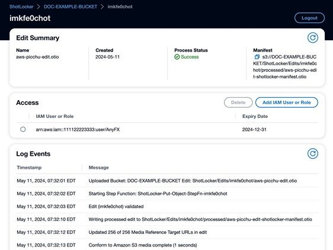
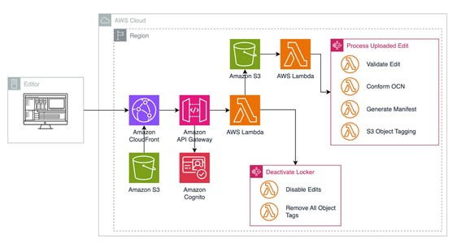

# Managing media access in a content lake using Shot Locker
by Patrick Palmer and Zach Willner on 13 JUN 2024 

[Original AWS Blog: Managing media access in a content lake using Shot Locker](https://aws.amazon.com/blogs/media/managing-media-access-in-a-content-lake-using-shot-locker/)

Hollywood studios are rapidly adopting cloud-based content production workflows to realize benefits such as scalability, security, and cost savings available with the cloud. However, a major challenge for content producers is allowing secure, controlled access to production media to third-party vendors, such as VFX houses and color grading teams.

Shot Locker is an example web application that demonstrates how cloud permissions management can be integrated into established editorial workflows. It allows an editorial team to easily grant third-party vendors access to only the specific media they need to work on within a centralized content repository in [Amazon S3](https://aws.amazon.com/s3/).

A feature film production can generate as much as 5 terabytes of media per day. To manage this data, a centralized storage system is essential for allowing review and editing. In alignment with [Movielabs 2030 vision](https://movielabs.com/production-technology/the-2030-vision/), a content lake is a structured approach for aggregating original camera negative (OCN), audio, proxies, and other metafiles from onset production into a predetermined file structure in Amazon S3. The defined structure of a content lake enables easy access to applications and automation of content production workflows.

### Operational Design

Shot Locker seamlessly integrates with an existing editing workflow and accommodates both offline and cloud-based workflows, including movie proxies and native footage editing. An editor simply uploads their editorial cut file (EDL, Avid AAF, FCP XML, OpenTimelineIO) to the Shot Locker website, which runs within their production Amazon Web Services (AWS) account. This file references the raw camera footage stored in Amazon S3. Behind the scenes, Shot Locker automatically parses the uploaded file to identify each piece of production media referenced and then tags each corresponding object in the Amazon S3 content bucket with a unique identifier specific to that edit, ensuring a seamless and efficient workflow.

An output manifest file is created in the [OpenTimelineIO](https://github.com/AcademySoftwareFoundation/OpenTimelineIO) interchange file format, which is widely adopted in the post-production industry. This file includes all identified assets stored in Amazon S3, each listed as an external media asset. If media is not found, it is flagged as missing. Using OpenTimelineIO ensures compatibility with downstream workflows and solutions that have integrated this format.

To grant a vendor access to media identified by the uploaded edit, the editor simply enters the vendor’s AWS user or role and sets an expiry date within Shot Locker. This automatically updates the Amazon S3 bucket policy to provide a vendor with temporary and restricted access to only the tagged objects related to the edit, without exposing the entire content repository. The vendor’s access is automatically revoked at the expiry date. The editor can also manually revoke access at any time with just a few clicks, eliminating the need for physical media transfers and minimizing the risk of unauthorized access.

Controlled access is critical for securing intellectual property while enabling efficient vendor workflows. This approach aligns with MovieLabs’ 2030 Vision principle of maintaining a single authoritative copy of all production media.

The Uploaded Edit Details page in the Shot Locker user interface provides a comprehensive overview of a media asset’s status and access control, featuring a summary section that displays the current processing status and a link to the generated manifest file. The page also allows you to manage access privileges for IAM users or roles, and includes a logs section that provides valuable information, warnings, or errors related to the processing and management of the uploaded edit.

### Architecture overview

Shot Locker is a [serverless](https://aws.amazon.com/serverless/) application deployed through the [AWS Cloud Development Kit](https://aws.amazon.com/cdk/) (CDK). It leverages services like [AWS Lambda](https://aws.amazon.com/pm/lambda/), [Amazon API Gateway](https://aws.amazon.com/api-gateway/), [AWS Step Functions](https://aws.amazon.com/step-functions/), and [Amazon Cognito](https://aws.amazon.com/cognito/). The web front-end is a React application hosted in an Amazon S3 bucket distributed by [Amazon CloudFront](https://aws.amazon.com/cloudfront/).

 * Website: Hosted in an Amazon S3 bucket using Amazon CloudFront Content Delivery Network
 * Users: Amazon Cognito for user identity and access management
 * API: AWS Lambda functions exposed via Amazon API Gateway
 * Processing: AWS Step Functions for edit file ingest and conforming to the Amazon S3 content repository
 * Logging: [AWS CloudWatch](https://aws.amazon.com/cloudwatch/) for processing and access logs

When an edit is uploaded, Step Functions orchestrates validation, conversion to the OpenTimelineIO interchange format, identifies referenced assets in S3, and tags those assets. S3 bucket policies are updated to grant and revoke access based on the tags.

_Figure 1 depicts the reference architecture for building the access control in a content lake on AWS._

The architecture is designed with security in mind. Only editors have permissions to grant vendor access to the content repository. The website never handles or stores actual production media.

Installing Shot Locker in your AWS account takes just a few steps:

1. Create a new Amazon S3 bucket to serve as your central content lake repository if you don’t already have one
2. Download and deploy the Shot Locker application using [AWS Cloud Development Kit](https://aws.amazon.com/cdk/) (CDK)
3. Create a Cognito user in the deployed user pool to log into the web interface
4. Log into Shot Locker and mark your Amazon S3 bucket as a Shot Locker repository
5. Upload an edit file, and Shot Locker automatically processes it

Once deployed, studios can leverage Shot Locker right away in their post-production workflows. Editors can upload cuts, grant and revoke vendor access permissions, view processing logs, and more—all through the web UI.

To avoid incurring future costs, users should clean up and delete example resources they no longer need. To uninstall Shotlocker from an AWS account, navigate to the [AWS CloudFormation](https://aws.amazon.com/cloudformation/) Services page, select the Shot Locker Stack, and delete it. This will remove all resources created during the CDK deployment; note, however, that this will not remove user permissions, content, or logs. These must be manually removed.

### Permissions

When an edit is uploaded by the editor, a unique 10-character alphanumeric identifier is generated. This unique identifier is added as a tag value to each production media asset identified in the edit, with the tag key being “ShotLockerAccess”. Multiple unique identifiers are assigned to a single object by separating them with a colon (“:”) in the tag value. However, due to the 255-character limit for S3 Object Tag values, an object can only be referenced by up to 23 different unique identifiers.

The access control mechanism for Amazon S3 buckets employs Bucket Policies, which are JSON documents that define access rules for S3 objects based on specific conditions. To grant or revoke access for an IAM user or role, the Bucket Policy needs to be modified accordingly.

### Conclusion

In this post, we described how an editorial cut can be used to manage access to production media in a content lake. To get started, check out the GitHub repo and deployment instructions. To learn about the underlying services needed for this application, visit the AWS product pages for Amazon S3, Amazon CloudFront, Amazon API Gateway, AWS Lambda, and AWS Step Functions.

### Authors

**Patrick Palmer**
Patrick Palmer is a Principal Solutions Architect for Games, Immersive, and AI/ML at AWS. He has led in the real-time 3D technology space for 25+ years, developing cutting-edge technologies and helping entertainment industry customers to navigate their greatest challenges.

**Zach Willner**
Zach is a Senior Partner Solutions Architect for Media and Entertainment at AWS. His role is building a diverse ecosystem of partners on AWS for Media and Entertainment.

